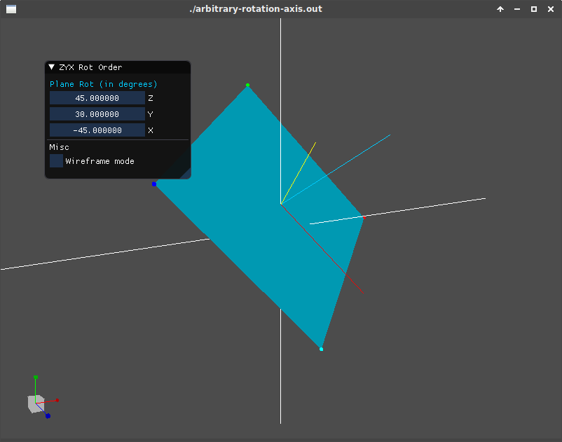
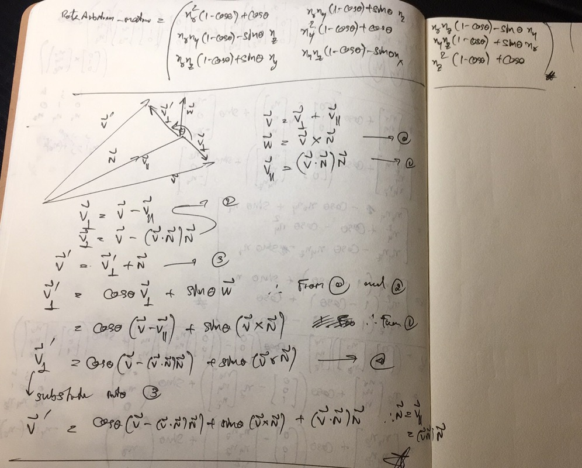

# ArbitraryRotationAxis

## Math Proof

Note that this proof has one mistake of using `V x N` instead of correct one `N x V` at the term
multiplying with `sine`. Use my proof will result in rotation in opposite direction. To correct,
just use `N x V`.
