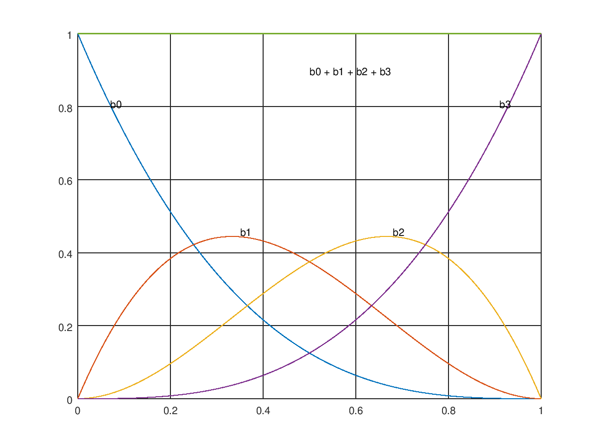

# BezierCurveCubic


# Additional

See the plotted of each term multiplying with each input point of polynomial term, its sum is equal to
1.

From the cubic equation

```
V(t) = ((1-t)^3)*P0 + 3*((1-t)^2)*t*P1 + 3*(1-t)*(t^2)*P2 + (t^3)*P3
```

wheres

* `b0 = ((1-t)^3)`
* `b1 = 3*((1-t)^2)*t`
* `b2 = 3*(1-t)*(t^2)`
* `b3 = (t^3)`
* `P0` and `P3` are the starting and ending point influencing the interior of the curve
* `P1` and `P2` are the controling points


