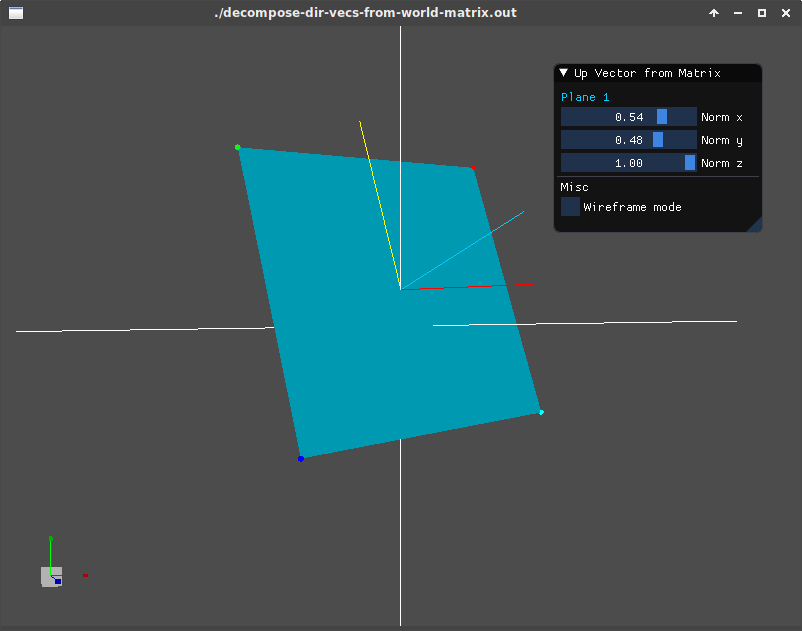

# DecomposeDirVectorsFromWorldMatrix

This example tries to prove that 2nd column vector from transformation matrix in world space
represents up vector of the object in the scene even after perform a certain rotation (or in fact
any combination of transformation on it).

See the lines coming out from the plane itself, they represent the following
* Red line represents *left vector*
* Yello line represents *up vector*
* Blue line represents *forward vector*

