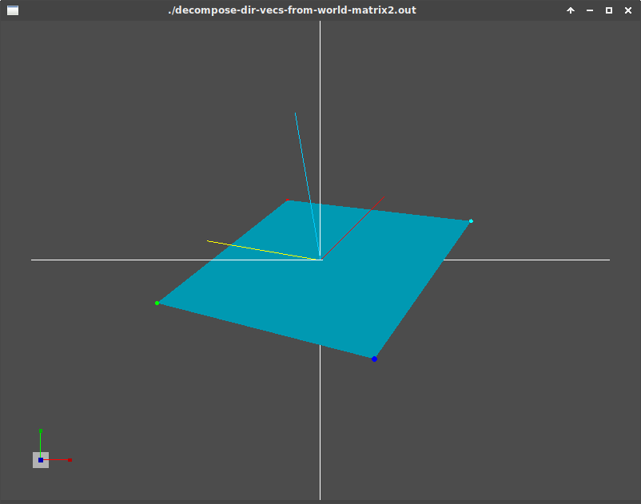
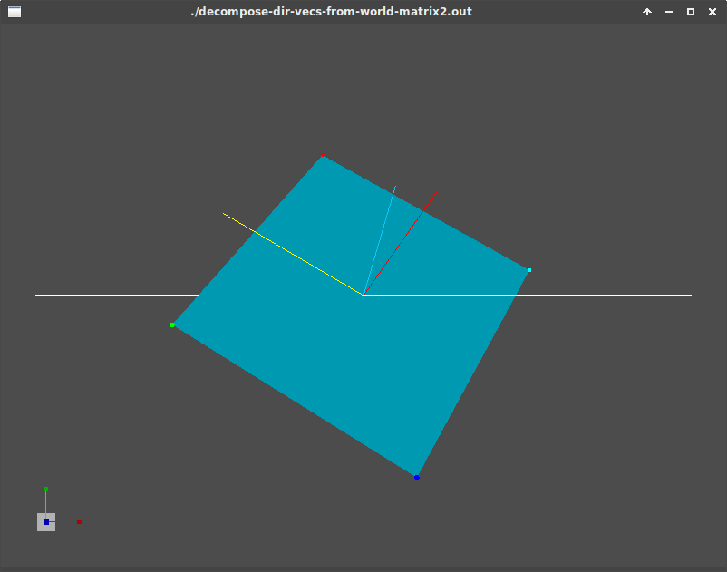
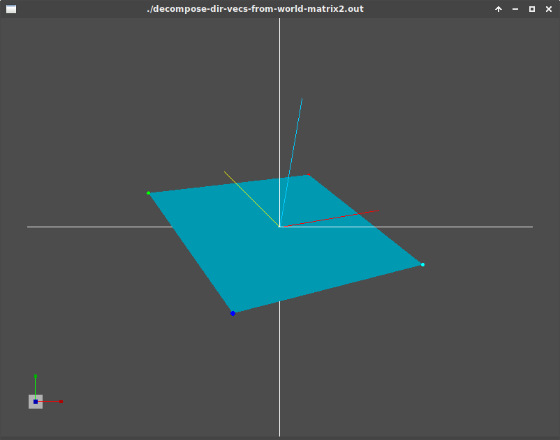
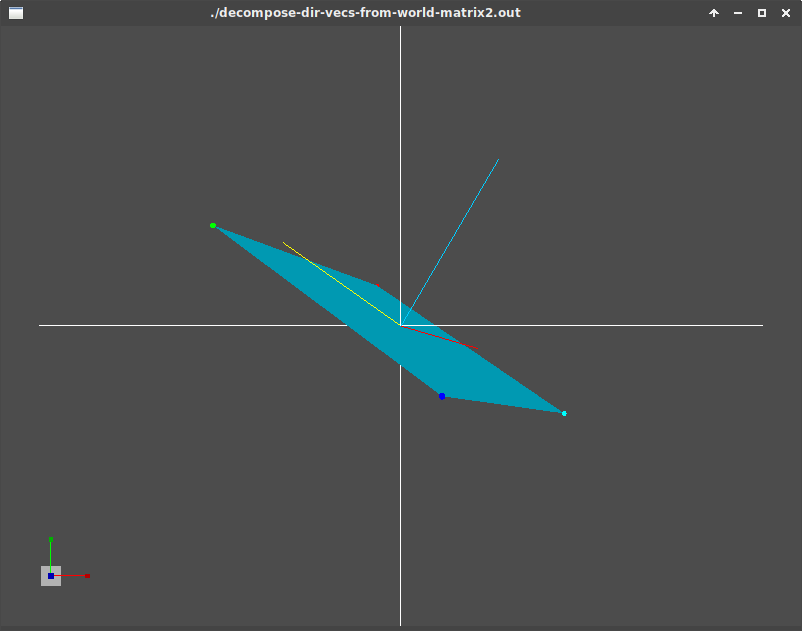
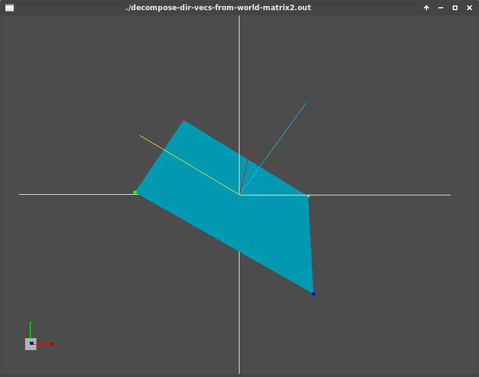
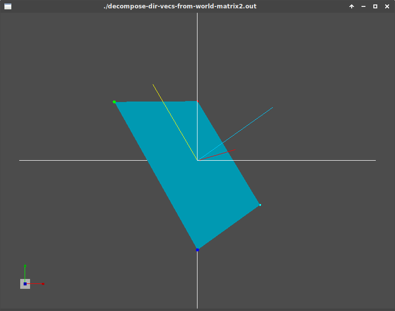

# DecomposeDirVectorsFromWorldMatrix2

*left*, *up*, and *forward* vectors extracted from transformation matrix in world space can represent
object's local coordinate or local axis.

Those vectors are drew on the screen as shown.

Notice that we use Euler Angles thus there are possibility of 6 ways each produce different result.
All of matrix operations perform the following in order

1. Rotate along L1 axis (L1 can either be X,Y, or Z)
2. Rotate along L2 axis (L2 can either be X,Y, or Z but not the same as L1 or L3)
3. Rotate along L3 axis (L3 can either be X,Y, or Z but not the same as L1 or L2)
4. Translate to the plane's position (in this case we put it at origin)

The following order of rotation i.e. `XYZ` means that the matrix multiplication is

```
result_rot_matrix = x_rot_matrix * y_rot_matrix * z_rot_matrix;
```

## XYZ



## XZY



## YXZ



## YZX



## ZXY



## ZYX


